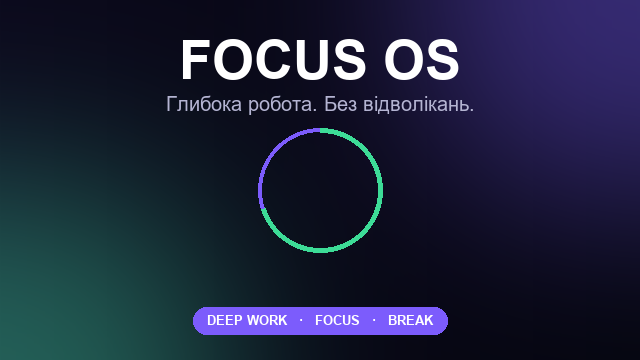

# Focus OS — Telegram Mini App ⏱️

Застосунок для глибокої роботи та фокусу, що відкривається в окремому вікні
всередині Telegram. Великий таймер із прогрес-кільцем, режими роботи,
статистика та вбудований музичний плеєр.



## Можливості

- ⏱️ **Таймер фокусу** з SVG-кільцем прогресу та тактильним відгуком
- 🎯 **4 режими**: Deep Work (50хв), Focus (25хв), Short (15хв), Break (5хв)
- 📊 **Статистика**: час за сьогодні / всього, кількість сесій, розподіл за режимами
- 👤 **Профіль**: ім'я з Telegram, автоматичне збереження сесій
- 🎵 **Музичний плеєр** з 4 джерелами:
  - 🎧 Демо-треки (вбудовані)
  - ☁️ Завантажені у Supabase Storage (адмін)
  - 🔗 Прямі посилання (`.mp3/.wav/.ogg`) — зокрема з домашнього сервера
  - 🎬 YouTube (embed)
- 🔐 **Авторизація** через Telegram initData (валідація HMAC-підпису)

## Стек

- **Backend**: Python 3.13 + FastAPI + Uvicorn
- **Frontend**: vanilla HTML/CSS/JS + Telegram WebApp SDK
- **DB**: SQLite (локально) → PostgreSQL/Supabase (у продакшені)
- **Storage**: Supabase Storage (опціонально, для завантажених треків)

## Структура проєкту

```
Vibecode/
├── app.py              # FastAPI сервер: сторінка + REST API
├── bot.py              # Telegram-бот (long polling) з кнопкою WebApp
├── db.py               # SQLite: користувачі, сесії, музика
├── storage.py          # Supabase Storage + класифікація URL/YouTube
├── telegram_auth.py    # Валідація initData (HMAC-SHA256)
├── config.py           # Налаштування з .env
├── expose.py           # Швидкий публічний тунель (Cloudflare)
├── make_cover.py       # Генератор обкладинки 640x360
├── make_demo_tracks.py # Генератор 2 демо-треків
├── static/
│   ├── index.html      # Mini App (SPA)
│   ├── styles.css
│   ├── app.js          # Логіка таймера/статистики/плеєра
│   ├── api.js          # API-клієнт з авторизацією
│   ├── cover.png       # Обкладинка для @BotFather
│   └── tracks/         # Демо-музика (*.wav)
├── requirements.txt
├── railway.json        # Конфіг деплою на Railway
├── Procfile
└── .env                # Секрети (у .gitignore)
```

## Швидкий старт (локально)

### 1. Встановлення залежностей

```bash
python -m pip install -r requirements.txt
```

### 2. Налаштування `.env`

```bash
cp .env.example .env
```

Відкрийте `.env` і заповніть:

```env
BOT_TOKEN=ваш_токен_від_BotFather
WEBAPP_URL=           # поки залишіть порожнім (заповнимо далі)
PORT=8000
ADMIN_IDS=ваш_telegram_id   # щоб додавати музику для всіх
```

> Дізнатись свій Telegram ID: напишіть боту @userinfobot

### 3. Створення асетів

```bash
python make_cover.py        # обкладинка (вже створено)
python make_demo_tracks.py  # демо-музика (вже створено)
```

### 4. Запуск сервера

```bash
python app.py
# або
uvicorn app:app --reload --port 8000
```

Сервер буде доступний на `http://localhost:8000`. Відкрийте в браузері —
побачите інтерфейс (авторизація Telegram не спрацює в браузері, але вигляд
оцінити можна).

### 5. Запуск бота (окремий термінал)

```bash
python bot.py
```

Напишіть боту `/start` — він відповість привітанням. Але кнопка "Відкрити
застосунок" потребує публічного HTTPS URL (див. далі).

## Публічний доступ для розробки (тунель)

Telegram вимагає HTTPS для WebApp. Щоб тестувати з локального комп'ютера,
підніміть тунель:

```bash
python expose.py
```

У виводі знайдіть рядок `https://xxxx.trycloudflare.com` і вставте його
у `.env`:

```env
WEBAPP_URL=https://xxxx.trycloudflare.com
```

Перезапустіть `bot.py` — тепер кнопка "🚀 Открыть приложение" працюватиме.

## Прив'язка Mini App у @BotFather

1. Відкрийте @BotFather → `/newapp`
2. Оберіть вашого бота
3. Назва застосунку: `Focus OS`
4. Опис: короткий опис
5. Завантажте зображення **640×360** — `static/cover.png`
6. Вставте `WEBAPP_URL` (HTTPS!)
7. Надішліть короткий вступний опис

Також можна встановити кнопку меню бота (робить `bot.py` автоматично через
`setChatMenuButton`, якщо `WEBAPP_URL` задано).

## Деплой у хмару (Railway + Supabase)

### Крок 1: БД на Supabase

1. Реєстрація на https://supabase.com (безкоштовно)
2. Створіть проєкт
3. У SQL Editor виконайте міграцію зі `schema/supabase.sql`
4. Збережіть `Project URL` та `anon key` (Settings → API)

### Крок 2: Storage на Supabase

1. Storage → Create bucket → ім'я `tracks` → **Public**
2. Цей бакет зберігатиме завантажену адміном музику

### Крок 3: Бекенд на Railway

1. Запуште код на GitHub
2. На https://railway.app → New Project → Deploy from GitHub repo
3. Додайте змінні оточення:
   ```
   BOT_TOKEN=...
   WEBAPP_URL=https://ваш-піддомен.up.railway.app
   PORT=8000
   ADMIN_IDS=...
   SUPABASE_URL=https://xxxx.supabase.co
   SUPABASE_KEY=anon_key
   SUPABASE_BUCKET=tracks
   ```
4. Railway дасть URL `https://focusos-production.up.railway.app`
5. Вставте його як `WEBAPP_URL` і перезапустіть

> ⚠️ Railway дає $5 кредиту/міс — вистачає на маленький бот.

### Крок 4: Бот

На Railway додайте ще один сервіс або запускайте `bot.py` локально
(long polling працює звідусіль).

## API-документація

| Метод | Шлях | Опис |
|-------|------|------|
| GET | `/api/health` | Статус сервера |
| GET | `/api/me` | Профіль користувача |
| GET | `/api/modes` | Доступні режими фокусу |
| GET | `/api/stats` | Статистика користувача |
| POST | `/api/session/finish` | Зберегти результат сесії |
| GET | `/api/tracks` | Список треків |
| POST | `/api/tracks/url` | Додати трек за посиланням |
| POST | `/api/tracks/upload` | Завантажити файл у хмару |
| DELETE | `/api/tracks/{id}` | Видалити трек |

Усі `/api/*` (крім `/health`) вимагають авторизації через Telegram `initData`
(у заголовку `Authorization: Bearer ...` або query `?init_data=`).

Інтерактивна документація API: `http://localhost:8000/docs`

## Ліцензія

MIT
